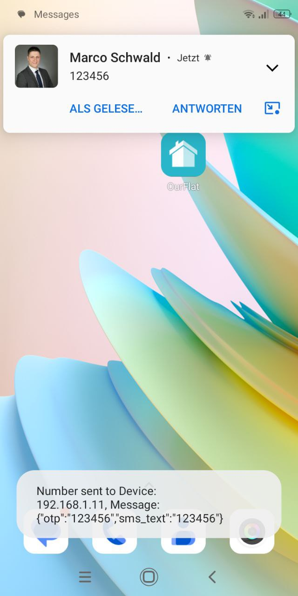

# OTP-Receiver
A lightweight UDP-based tool that receives SMS codes and messages over the local network and displays them clearly. Features balloon notifications, pop-ups, and real-time logging. Compatible with smartphones using MacroDroid or other similar apps.

- ⚠️ This project is complete and no longer actively maintained.
- ⚠️ Dieses Projekt ist abgeschlossen und wird aktuell nicht weiterentwickelt.
---

## Features
- Receives OTPs and messages via UDP from mobile devices
- Displays messages in a list with timestamp
- Shows balloon notifications and temporary pop-up windows
- Real-time logging of received messages
- Integrates with MacroDroid or similar automation apps
- Automatic clearing of the message list every 5 minutes
- Starts minimized in the system tray

---

## Screenshots
### Main Window

### Pop-up Notification

### MacroDroid Macro

---

## Installation
### PC
1. Clone or download this repository.
2. Open `setup.exe` or `OTP-Receiver.exe`.

### Android
1. Install MacroDroid or a similar app: [MacroDroid on Play Store](https://play.google.com/store/apps/details?id=com.arlosoft.macrodroid&pcampaignid=web_share&aff=marcoschwald.de)
2. Import the macro `SMS_Code_Copierer_and_LAN_Sharing.macro`.

---

## Support
- Work with me on the project.
- Make suggestions to improve the script.
- [Donate a coffee on Patreon](https://www.patreon.com/join/marcoschwald)
- 

---

## Contact
<a href="https://marcoschwald.de/kontakt/kontakt.php" target="_blank">Contact</a>

---

## Updates
All updates, fixes, and new releases for OTP-Receiver are published here:  
[https://marcoschwald.de/project/otp-receiver/update](https://marcoschwald.de/project/otp-receiver/update)

---

## Security Issues / Vulnerability Reporting
We take security seriously. If you discover a vulnerability, please do **not** create a public issue.  
Responsible disclosure can be submitted through our contact form on [marcoschwald.de](https://marcoschwald.de/kontakt/kontakt).

We will respond promptly and work to release a fix as soon as possible.  
Your responsible disclosure helps keep the project safe for all users.

---

## License
Copyright (c) CS-Digital UG (haftungsbeschränkt) https://cs-digital-ug.de/  
and Marco Schwald https://marcoschwald.de/ 

THE SOFTWARE IS PROVIDED "AS IS", WITHOUT WARRANTY OF ANY KIND, EXPRESS OR IMPLIED,  
INCLUDING BUT NOT LIMITED TO THE WARRANTIES OF MERCHANTABILITY, FITNESS FOR A PARTICULAR PURPOSE AND NONINFRINGEMENT.  
IN NO EVENT SHALL THE AUTHORS OR COPYRIGHT HOLDERS BE LIABLE FOR ANY CLAIM, DAMAGES OR OTHER LIABILITY,  
WHETHER IN AN ACTION OF CONTRACT, TORT OR OTHERWISE, ARISING FROM, OUT OF OR IN CONNECTION WITH THE SOFTWARE OR  
THE USE OR OTHER DEALINGS IN THE SOFTWARE.

---

## Haftung (German)
- §1 Es wird keine Haftung für das Projekt übernommen.  
- §2 Sollten einzelne Bestimmungen dieses Vertrages unwirksam oder undurchführbar sein oder nach Vertragsschluss unwirksam oder undurchführbar werden, bleibt davon die Wirksamkeit des Vertrages im Übrigen unberührt. Die unwirksame bzw. undurchführbare Bestimmung soll durch eine wirksame Regelung ersetzt werden, deren Wirkung der wirtschaftlichen Zielsetzung am nächsten kommt. Diese Bestimmungen gelten entsprechend, falls sich der Vertrag als lückenhaft erweist.

---

## Liability (English)
- §1 No liability is assumed for this project.  
- §2 Should any provision of this agreement be or become invalid, unenforceable, or ineffective, either at the time of conclusion or later, the validity of the remaining provisions shall remain unaffected. The invalid or unenforceable provision shall be replaced by a valid and enforceable one that comes closest to the economic purpose intended by the parties with the original provision. The above provisions apply accordingly in case of gaps in this agreement.
